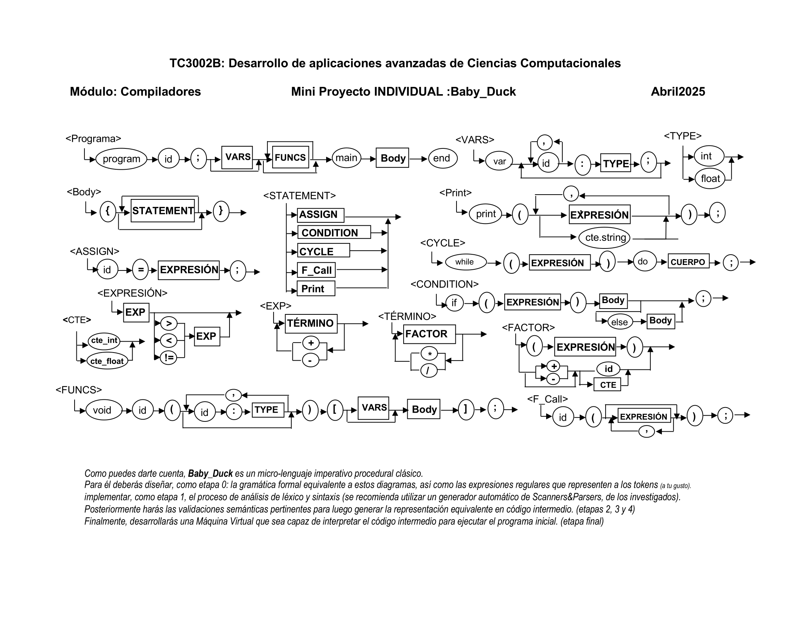

# Entrega 0

Revisa el archivo que contiene la descripción gráfica de un mini-lenguaje:

A partir de ella deberás:

1. Diseñar las Expresiones Regulares que representan a los diferentes elementos de léxico que ahí aparecen.
2. Listar todos los Tokens que serán reconocidos por el lenguaje
3. Diseñar las reglas gramaticales (Context Free Grammar) equivalentes a los diagramas.
4. Genera, como parte de la entrega, un Documento que contenga la definición de las expresiones regulares y reglas gramaticales desarrolladas. Considera que este documento irá creciendo conforme trabajes en las siguientes entregas. (esta primera entrega pudiera ser "a mano", pero eventualmente debes poner todo en un procesador de textos y un procesador gráfico).